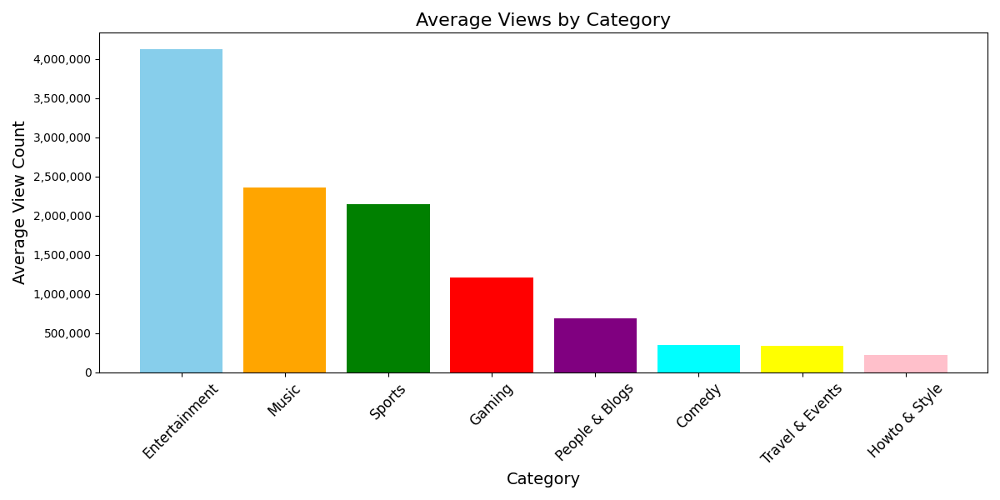

# 빅데이터처리 기말 프로젝트

## 📌 주제
**유튜브 인기 영상 제목과 조회수의 상관관계 분석**

---

## 🔍 주제 선정 이유
YouTube는 현재 세계에서 가장 큰 동영상 플랫폼으로, 사람들이 다양한 콘텐츠를 소비하는 공간입니다.  
본 프로젝트는 제목과 조회수의 관계를 분석하여 콘텐츠 제작자들이 더 효과적으로 영상을 기획하고 제목을 설정할 수 있는 방법을 제시하기 위해 진행되었습니다.

---

## 📊 데이터 수집
- **수집 방법**: YouTube Data API를 사용하여 인기 동영상 데이터를 수집하였습니다.
- **데이터 항목**:
  - 동영상 제목, 카테고리, 조회수, 좋아요 수, 댓글 수, 업로드 날짜 등.
- **수집 범위**: 인기 동영상 상위 50개의 데이터를 대상으로 분석.

---

## 🔮 데이터 분석 결과 예상
1. **제목 길이와 조회수**:
   - 짧고 간결한 제목일수록 조회수가 높을 가능성이 있다.
2. **카테고리별 조회수 차이**:
   - 특정 카테고리(예: 엔터테인먼트, 음악 등)의 평균 조회수가 다른 카테고리보다 높을 가능성이 있다.
3. **키워드와 조회수 관계**:
   - 제목에 특정 인기 키워드가 포함될 경우 조회수가 상승할 가능성이 있다.

---

## 📊 분석 및 시각화 결과
### 1. **카테고리별 평균 조회수**
- `Entertainment` 카테고리가 가장 높은 평균 조회수를 기록.
- `Music`과 `Sports` 카테고리가 뒤를 이음.

#### 📊 시각화 결과

### 2. **제목 길이와 조회수의 상관관계**
- 짧은 제목(20자 이하)이 긴 제목보다 더 높은 평균 조회수를 기록.
- 제목 길이에 따른 조회수 분포도는 추가 분석 진행.

---

## 🔧 사용된 기술
- **Python**: 데이터 수집, 전처리 및 분석
  - 라이브러리: pandas, matplotlib
- **YouTube Data API**: 데이터 수집
- **Colab**: 프로젝트 실행 환경

---

## 🚀 프로젝트 진행 과정
1. YouTube Data API를 통해 데이터를 수집하고 CSV 파일로 저장.
2. pandas를 사용해 데이터 전처리 및 통계 분석.
3. matplotlib를 사용해 데이터를 시각화하여 주요 인사이트를 도출.
4. README 및 프로젝트 결과물을 GitHub에 정리 및 업로드.

---

